# 游戏核心逻辑心得与调试

作者：徐震

## 关于模块化

核心模块共包含如下的Verilog Implementation文件：

- `core.v`

- `lfsr.v`

- `clk_div.v`

- `collision_check.v`

- `food_check.v`

- `key2di.v`

- `moving_snake.v`

以及如下的接口文档说明文件：

- `INTERFACE_CORE.TXT`

以及调试用的Test Fixture文件：

- `core_sim.v`
- `clk_div_sim.v`
- `key2di_sim.v`
- `moving_snake_sim.v`

其中`core_sim.v`是`core.v`模块的总体调试文件，通过这个文件的调试可以检查所有模块的功能是否正常

- 关于如何利用ISim进行高效调试笔者会在下面提到

每个小模块的单独模拟结果这里就不进行完整列举，可通过ISE的ISim结合调试文件进行测试

注意各个文件的接口可能会发生微小的变化，调试时若报错请进行微小调整

核心模块的总体调试文件`core_sim.v`是存储下面列举的调试信息的文件，下面具体列举对各种功能的调试结果


## 关于模拟（调试）

### 食物检查

- 蛇的初始位置为左上角
- 相同色系的为同一条小蛇
- 小蛇的头部被标记为同一色系的深色
- 小蛇的食物被做了标记（颜色与小蛇的头相同）
- 初始的方向都是向右，因此一段时间后小蛇应该会分别吃到食物并撞墙牺牲
- 食物模块应该会检测到这一过程的发生并产生新的食物
- Test Fixture中对撞墙后的状态进行了重新初始化，因此上述过程会重复，但是新产生的食物的位置应该是随机的

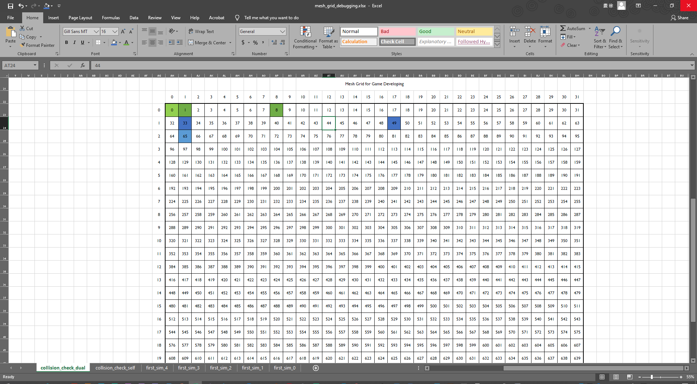

```verilog
module core_sim;
    reg clk;
    reg [12:0] keystroke;
    core #(.max_len(15),
    .max_len_bit_len(4),
    .clk_div_num(1250),
    .init_score1(2),
    .init_score2(2),
    .init_food1(10'b0000001000),
    .init_food2(10'b0000110001),
    .init_snake1({{(16-2)*10{1'b1}},20'b0000000000_0000000001}),
    .init_snake2({{(16-2)*10{1'b1}},20'b0001000000_0000100001})
    ) uut (
        .clk_raw(clk), 
        .keystroke(keystroke)
    );

    initial begin
        keystroke = 13'b10000_0010_0010;
        #10000000; keystroke[8] = 1;#50 keystroke[8] = 0;
        #10000000; keystroke[8] = 1;#50 keystroke[8] = 0;
        #10000000; keystroke[8] = 1;#50 keystroke[8] = 0;
    end
    initial begin
        clk = 0;
        forever #5 clk =~clk;
    end
      
endmodule
```

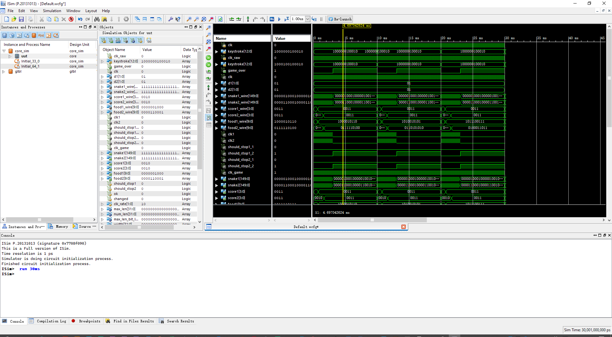

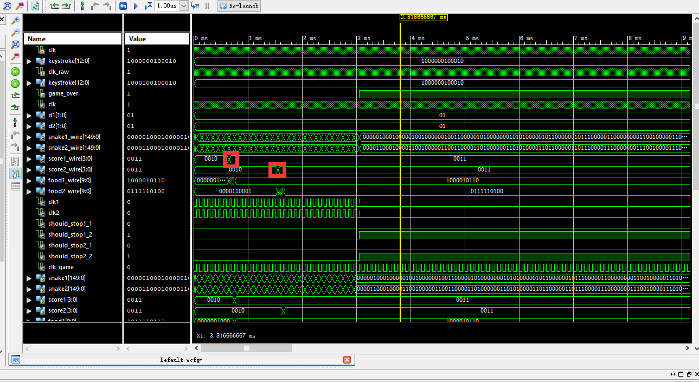

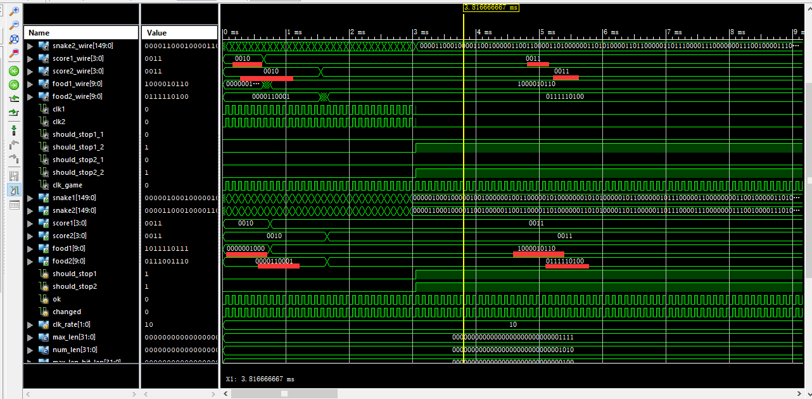

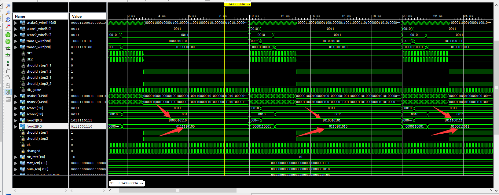

可以发现：

- 小蛇在吃到食物之后食物的位置会更新
- 并且做到了伪随机更新（不同时刻生成的食物位置不同）
- 且食物符合生成的要求（不在屏幕显示范围之外，不在蛇身体上等）

### 撞击检查

#### 自己与自己撞击

- 蛇已经被为蓝色

- 深色为蛇的头部
- 初始的方向为向上，因此蛇应该在移动一格后停住

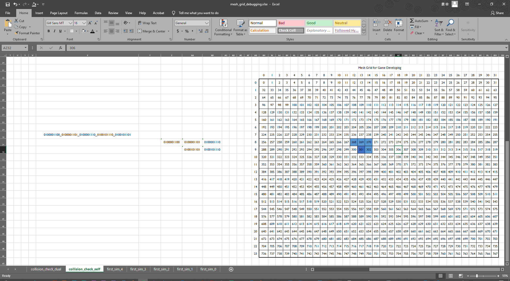

```verilog
module core_sim;

    // Inputs
    reg clk;
    reg [12:0] keystroke;
    core #(.max_len(15),
    .max_len_bit_len(4),
    .clk_div_num(1250),
// These two lines are used to verify whether the snake will stop if it collides with its body
    .init_score1(5),
    .init_snake1({{(16-5)*10{1'b1}},50'b0100001100_0100001101_0100001110_0100101110_0100101101})
    ) uut (
        .clk_raw(clk), 
        .keystroke(keystroke)
    );

    initial begin
    // These two lines are used to verify whether the snake will stop if it collides with its body
        keystroke = 13'b10000_1000_0100;
        #10000000;
        keystroke[8] = 1;#50 keystroke[8] = 0;
    end
    initial begin
        clk = 0;
        forever #5 clk =~clk;
    end
      
endmodule
```

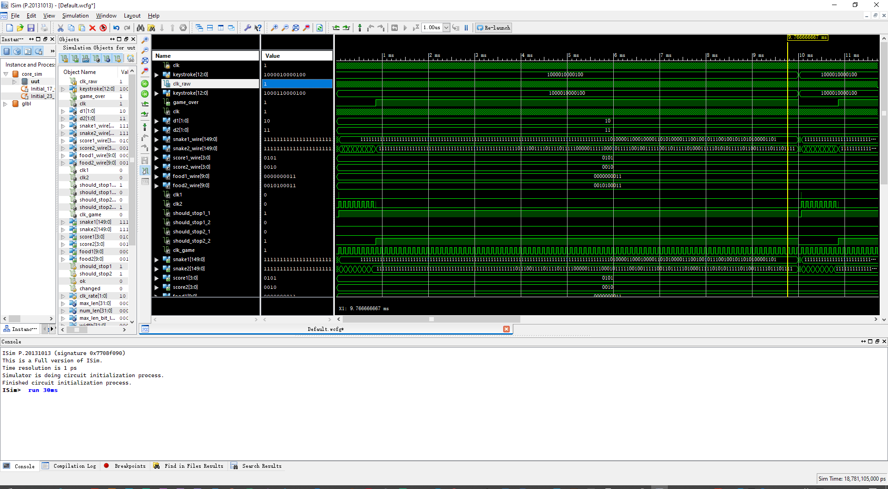

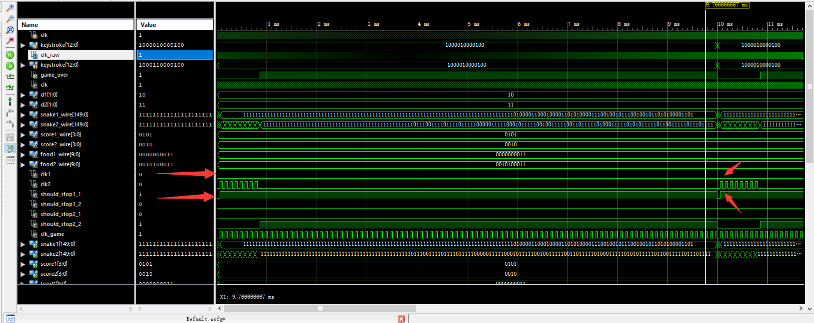

可以发现：

- 小蛇在时钟周期来临的时候及时停住了

#### 自己与另一条小蛇撞击

- 小蛇的位置与食物检查时相同

- 只不过这次的方向是：

  - 绿色小蛇向右而蓝色小蛇向上

  因此蓝色小蛇会撞上绿色小蛇，并停止运动

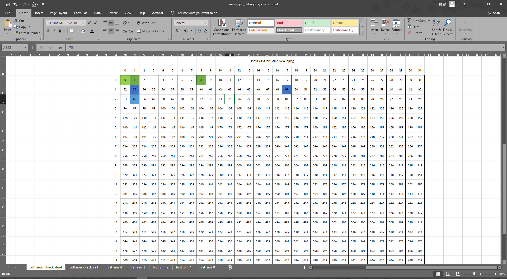

```verilog
/* verilator lint_off STMTDLY*/
module core_sim;

    // Inputs
    reg clk;
    reg [12:0] keystroke;

    // Instantiate the Unit Under Test (UUT)
    core #(.max_len(15),
    .max_len_bit_len(4),
    .clk_div_num(1250),
// These two lines are used to verify whether the snake will stop if it collides with its body
    .init_score1(5),
    .init_snake1({{(16-5)*10{1'b1}},50'b0100001100_0100001101_0100001110_0100101110_0100101101})

    ) uut (
        .clk_raw(clk), 
        .keystroke(keystroke)
    );

    initial begin
    // These two lines are used to verify whether the snake will stop if it collides with its body
        keystroke = 13'b10000_1000_0100;
        #10000000;
        keystroke[8] = 1;#50 keystroke[8] = 0;

    end
    initial begin
        clk = 0;
        forever #5 clk =~clk;
    end
      
endmodule
```

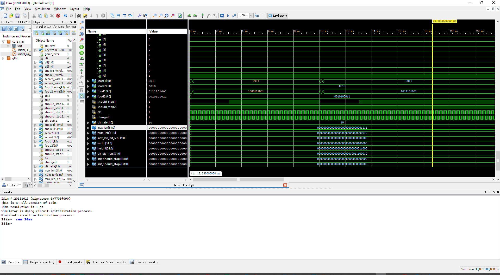

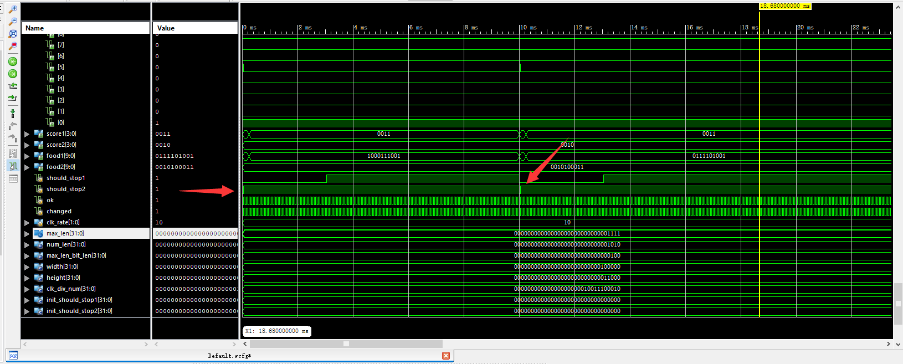

可以发现：

- 蓝色小蛇按照预期停住了，而绿色小蛇继续运行

### 总体模拟

这里我们尝试了改变方向，更新系统等操作，发现均能正常运行

```verilog
/* verilator lint_off STMTDLY*/
module core_sim;

    // Inputs
    reg clk;
    reg [12:0] keystroke;

    // Instantiate the Unit Under Test (UUT)
    core #(.max_len(15),
    .max_len_bit_len(4),
    .clk_div_num(1250)
    ) uut (
        .clk_raw(clk), 
        .keystroke(keystroke)
    );

    initial begin

    // These line are general test cases    
        keystroke = 13'b10000_1000_0010;
        #1000000 keystroke = 13'b10000_0010_0100;
        #1000000 keystroke[9] = 1;
        #1000000 keystroke = 13'b10000_1000_1000;
        #1000000;
        keystroke[8] = 1;#50 keystroke[8] = 0;
        #1000000;
        keystroke[8] = 1;#50 keystroke[8] = 0;
        #4000000 keystroke = 13'b10000_1000_0010;
        keystroke[8] = 1;#50 keystroke[8] = 0;
        #1000000 keystroke = 13'b10000_0010_0010;
        #10000000;
        keystroke[8] = 1;#50 keystroke[8] = 0;
        keystroke = 13'b10000_1000_0010;
        #1000000 keystroke = 13'b10000_0010_0100;
    end
    initial begin
        clk = 0;
        forever #5 clk =~clk;
    end
      
endmodule
```

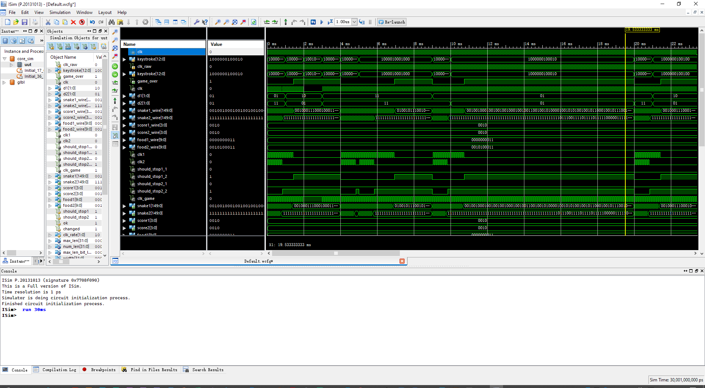

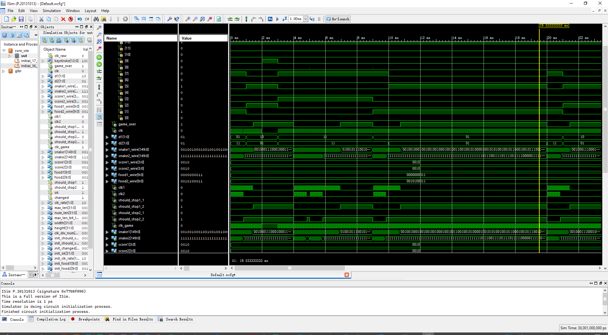

箭头指向的部分为重置游戏与暂停游戏的部分

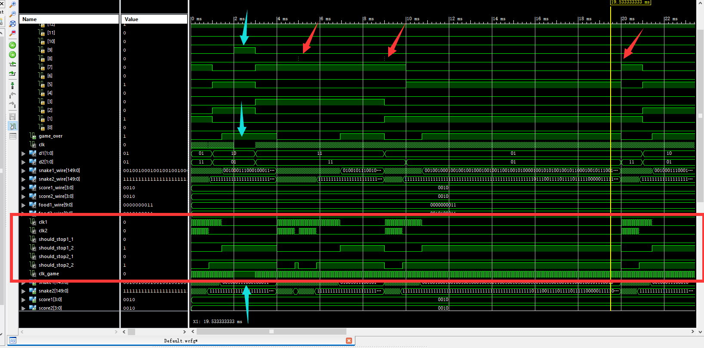

## 关于Verilog与硬件设计

在使用Verilog这种硬件描述语言的过程中，我们可以注意到许多与普通的程序设计语言不同的地方，例如

- Verilog最终是要转化为某种实际可以存在的硬件结构的，如果从语法层面这一设计就无法存在，应直接修改设计思路

- 某种意义上，Verilog是最底层的语言。Verilog描述CPU的结构，汇编对CPU进行指令发送操作，其他高级语言被编译或者解释为汇编（也就是CPU的指令）

  因此，在这种底层语言上，我们被给予了最大的权力来决定自己使用什么东西和不使用什么东西。能耗以及成本都可以降到最低。（汇编可以决定对CPU发送的指令以达到较快的速度，而Verilog可以直接从硬件层面更改我们所需要的资源）

个人认为，从应用层面讲，用硬件来设计游戏并不是个什么好的项目

- 用硬件结构设计游戏在游戏逻辑的安排上很是困难

- 硬件设计会导致游戏设计者考虑太多与游戏运行本身无关的事情

- 一个游戏本质上是顺序执行的，即使是用汇编进行设计应该也会比Verilog简单得多，因为Verilog的逻辑就是并行，同步

  例如在Flip-flop应用中，如果对寄存器采取阻塞赋值，ISE会禁止我们这样做
  
  再例如在多个always语句中（即使触发条件相同），如果对同一个寄存器赋值，ISE也会拒绝综合我们的Verilog代码（即使这段代码已经仿真通过），因为ISE会将我们的Verilog代码尝试解释成硬件，但多个触发器对同一个寄存器赋值往往会导致不可预料的结果（无法预知什么时候会被触发，什么时候会冲突）
  
  因此许多本来用顺序描述语言简单清楚易表达的概念在Verilog中就会变得复杂臃肿
  
- 硬件对于时序的要求极为严格，例如寄存器赋值，组合电路传输等等都会导致延迟，游戏设计过程中我们往往会忽略这些延迟，尤其是当我们的游戏逻辑涉及到对时钟的操作时（很不幸的是，我们的游戏模块中没能避免使用这样的设计）。但这就存在着一定的时序风险，游戏很可能不会正常工作。

但作为一个课程作业，这种设计方式对同学们的锻炼是显而易见的。要做出能够正常运行的电路设计，首先就要克服上述提及的几个问题。个人的观点是，对于硬件接触较少的同学来讲，这个过程里最为头痛的部分是软件设计思维与硬件设计思维上的转换，其次是Verilog这门语言的参考资料较少，网络上相关的权威解读又难以查询（虽然有IEEE标准，但标准中的描述对初学者并不友好），学习起来会有一定的阶梯性。

例如，Verilog的语法中包含一个叫做`generate`的逻辑块，若不是输入了`generate`和`Verilog`作搜索引擎的关键词，就很难得到权威的解释。我们可以在网上发现这样的[内容](https://zhidao.baidu.com/question/126265717.html?qbl=relate_question_2&word=verilog%20%D1%AD%BB%B7%C9%FA%B3%C9%C4%A3%BF%E9)，但实际上提问者描述的就是`generate`语句块的使用。这是我在搜索过程中找到的[一个比较通俗的描述](https://www.chipverify.com/verilog/verilog-generate-block)。

我们在写最终的`vga_main()`模块时就成功用`generate`语句将接近一千行的难以维护的代码缩减成个位数的行数，不仅提高了维护性，可读性，还降低了工作量。

再如对于变量（内存）的参数控制（Synthesis HDL Attribute）（例如`reg`关键字前加`(*ram_style="block"*)`可以让ISE将此变量存在Block Memory而不是查找表`(*ram_style="identity")`中，这一参数控制可以引导ISE对Verilog代码的综合流程以节约或合理分配板上资源，我们在写最终模块的时候就遇到了板上资源不足的问题（实际是足够的，只是ISE将一些东西全部挤到了一起））。

还有一个例子是Verilog中对于内存Slice的特殊要求，它不能作为变量被传输且Verilog不支持二维内存数组也就是类似`reg a [3:0][3:0]`的形式（但是SystemVerilog支持），而单纯的寄存器类型（`reg [3:0][3:0]a`）却支持二维类型的创建。不幸的是，ISE在综合时只会将他们作为一维变量看待。这对于只凭经验研究Verilog的学生（而不是进行完整的系统学习）来说是有一定难度发现的。

最后，让我再提一点，就是Verilog中对Slice（切片）的运用。在硬件设计中，如果我们想要取得数组的某一部分做操作或判断，这一数组必须是定长的（这个规律我自己就查了很久才了解到），因此Verilog引入了一种奇怪的切片方式`[variable+:constant]`，其中的variable可以是`reg`或者`wire`类型的变量，constant只能是一个常数。这种形式可以很方便的用在循环中（编程语言的强大之处不就在于循环吗？），但我们如果这样写`[variable_1:variable_2]`，即使`variable_2-varible_1`永远是一个常数，Verilog的语法也不允许。

## 关于ISE

ISE是Xilinx配合其生产的FPGA或其他硬件资源的集成开发平台。其中有不少值得探究的内容。

在编写核心逻辑部分代码的时候，我主要探究了其中ISim的使用以及生成代码的一些优化选项。

### 关于ISim

（这段文字是使用ISim时随手记录的，所以用了英文）

The right tool generates the right result and user experience as long as you're able to fulfill its full potential. So it is with our logic design simulator: `ISim`. Not until the end of this experiment was I aware of the strength of this simulator.

1. Variables inside the simulation module can be accessed from the left panel

   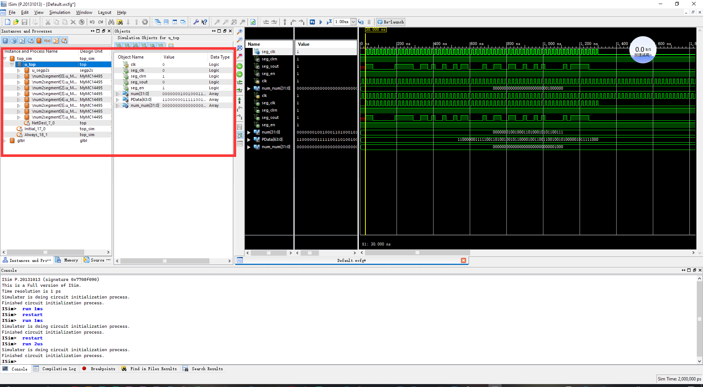

   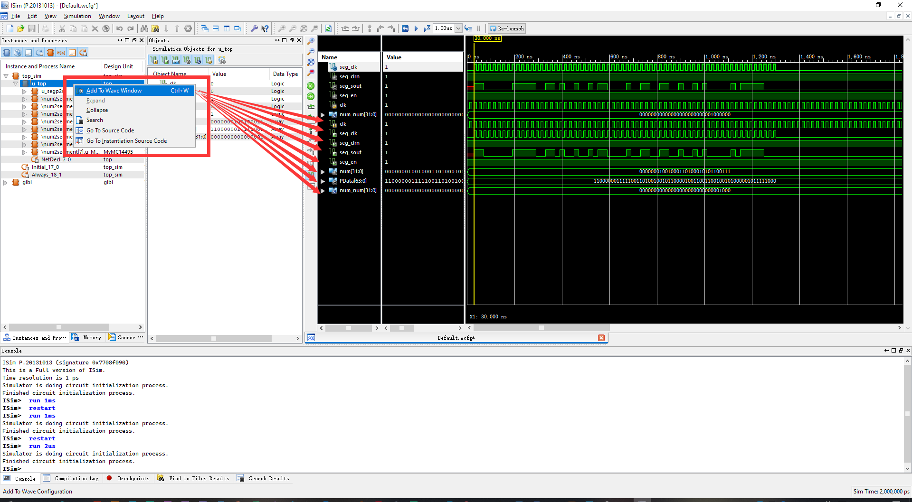

2. The command line(and GUI) supports rich operation, there's even a list of possible usage listed by Xilinx

   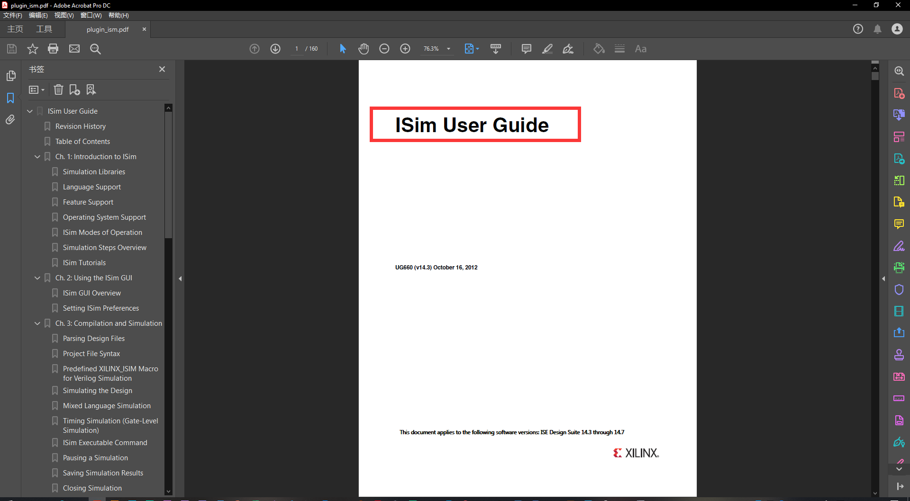

   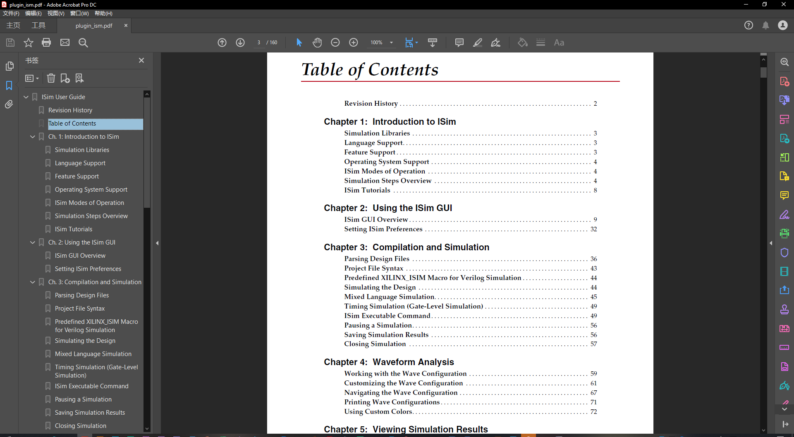

   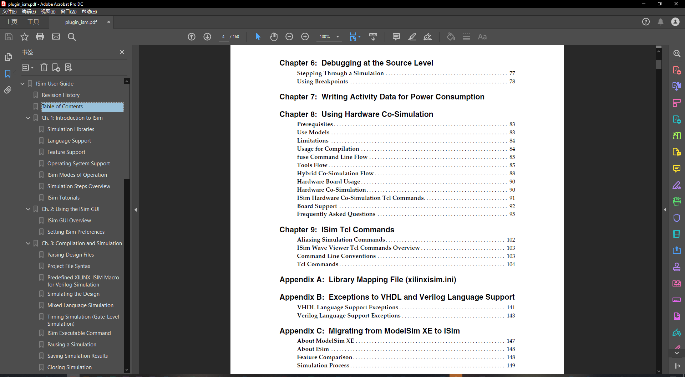

3. Some examples:

   - Restart and re-run

      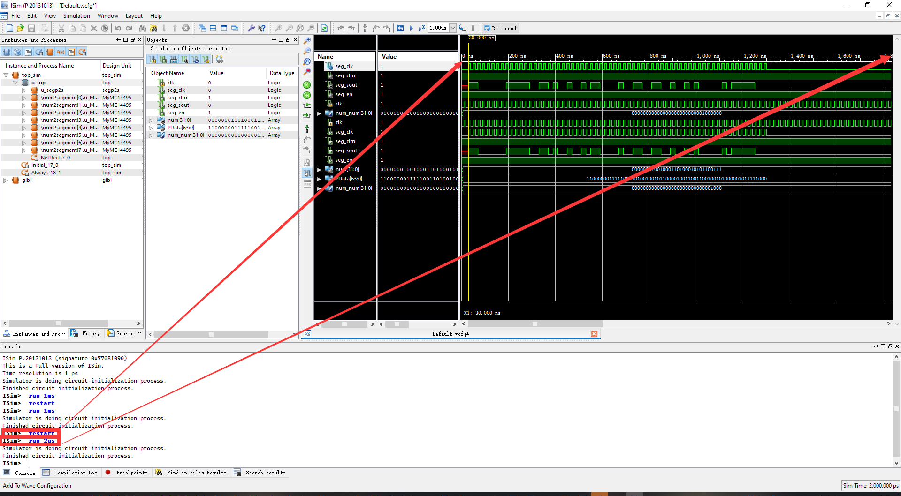

   - show full value:

      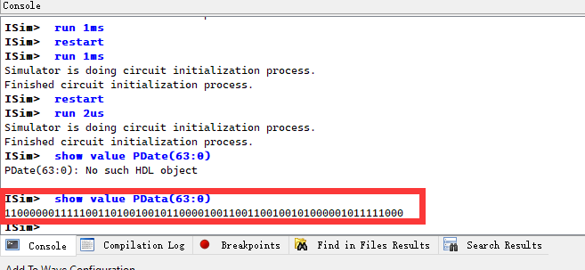

   - Load already saved wave configuration or waveform storage:

      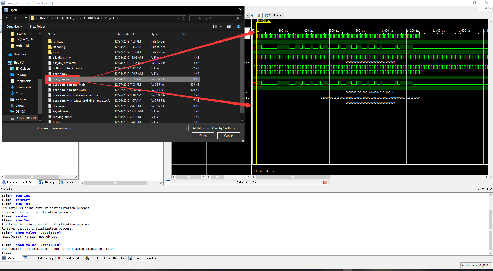


### 关于优化

在本次项目的实现过程中，我们花最多时间的地方，不是写代码，不是画图，甚至不是查资料。而是一遍又一遍的进行从Synthesize到Generate Programming File这一漫长的过程。

参考这篇[博客](https://blog.csdn.net/zhou8400/article/details/81002763)，我了解到ISE还有很多潜能亟待开发。

1. 可以控制所需要的优化类型（空间或速度），这对于资源紧张的设计非常有用

2. 可以控制是否进行多核编程（`map`过程最高使用2核，`PAR`过程最高使用2核）

3. 在同一系统下，即使是Windows，也有办法运行多个ISE来对同一个项目进行综合布线

   这样做能够最大限度地利用我们的资源，例如我的个人PC有12核，而ISE最耗时的`map`最高只占用2个，这种方式可以让我们的等待时间大为缩短。

   当我们不确定多个小的改动哪一个能达到预期的目标时，我们完全可以将工程文件夹复制一份，并用多个ISE进程同时进行综合布线

   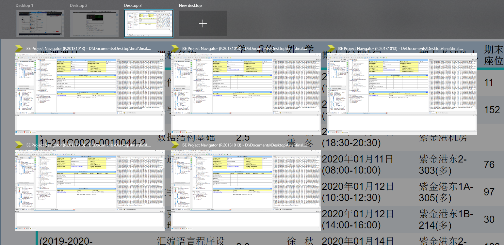

4. 在用ISE自带工具ISim进行模拟的时候，可以将不必要的时钟略去，例如本来我们需要累加五百万次系统时钟以得到一个周期为1s的信号，在模拟过程中完全可以将这个数字缩小到五千甚至五百，既能加快模拟时候的计算速度，又能减小模拟结果的波形数据库所占空间

   - 进行优化前

     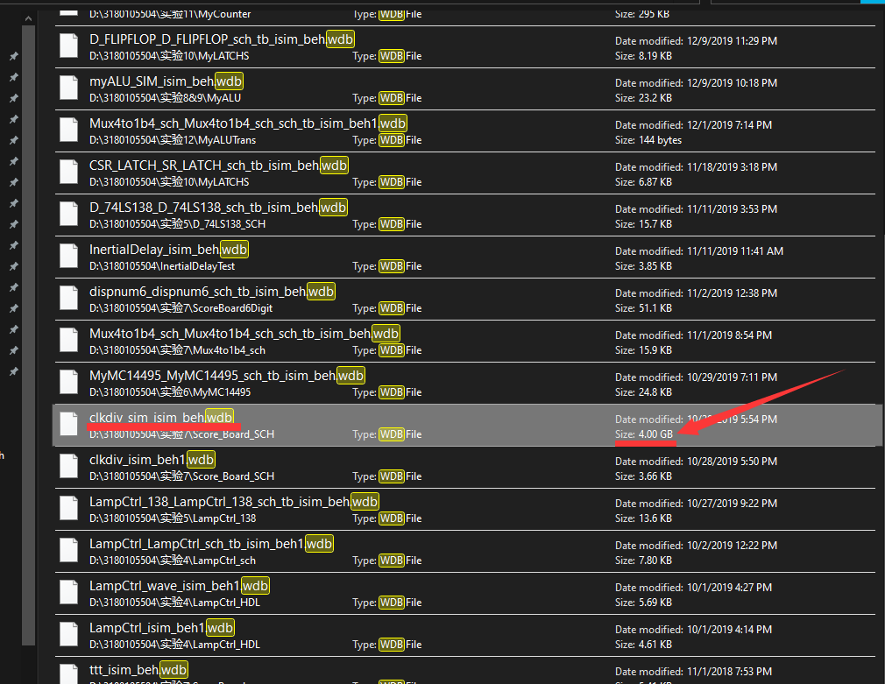

   - 进行优化后

     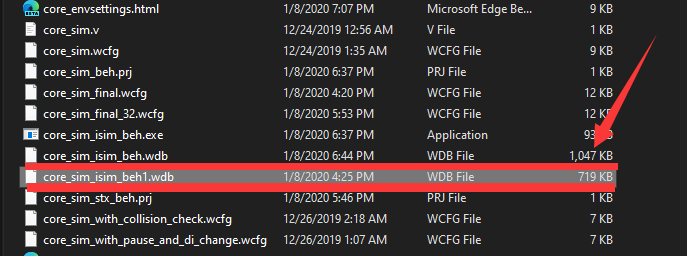

     这两者的区别就在于`clk_div`分时模块所采用的累加策略：
     
     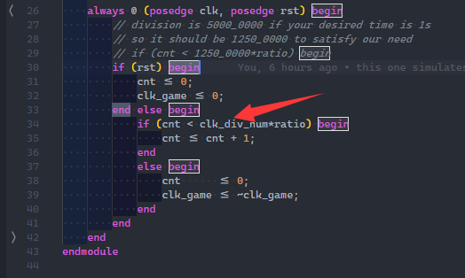
     
     这一常数`clk_div_num`是1250_0000时会得到类似图1的结果，而1250时就会得到类似图2的结果.。

## 关于Visual Studio Code

（这段内容也是我调试过程中的随笔，所以语言采用了英文）

Some editor-related changes are not easy to be made inside the ISE default editor, so during the process of finishing today’s experiment I also tested the possibility of writing Verilog code using a much handier text editor, such as Visual Studio Code.

Surprisingly, there do exist multiple approaches to fulfill that wish. Quantities of extensions are accessible in Visual Studio Code, with the help of which, we can easily get the following functions

- Auto Completion

   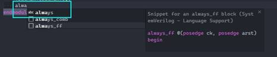

- Code Snippet

   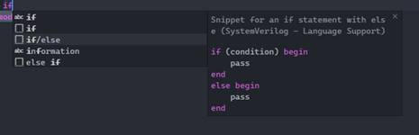

- Reference Searching

   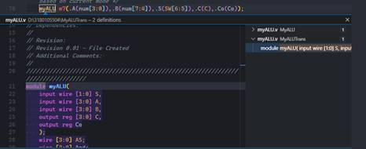

- Auto Format

   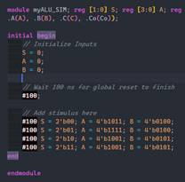

- Advanced Syntax Highlighting

   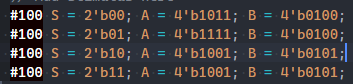

- Handy Syntax Checking

   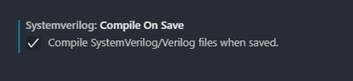